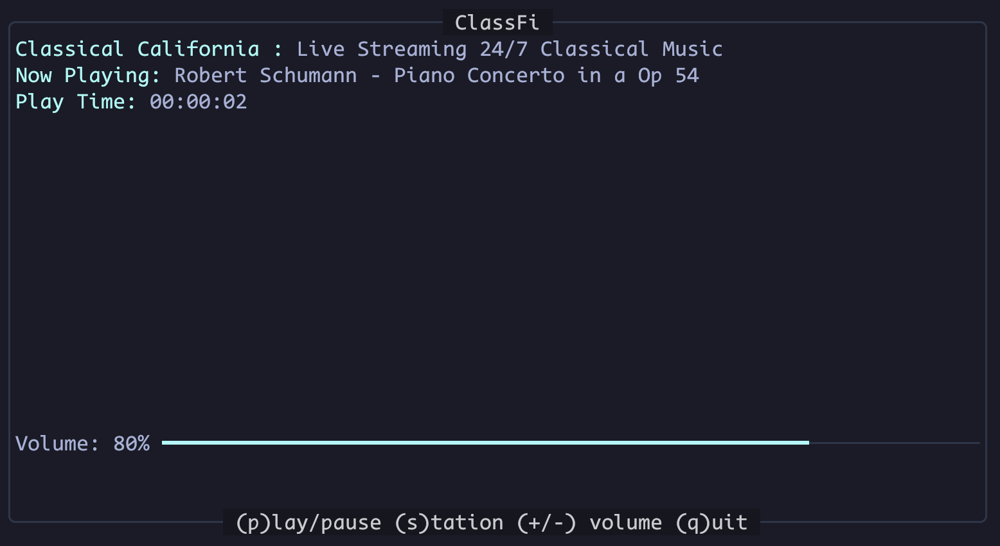
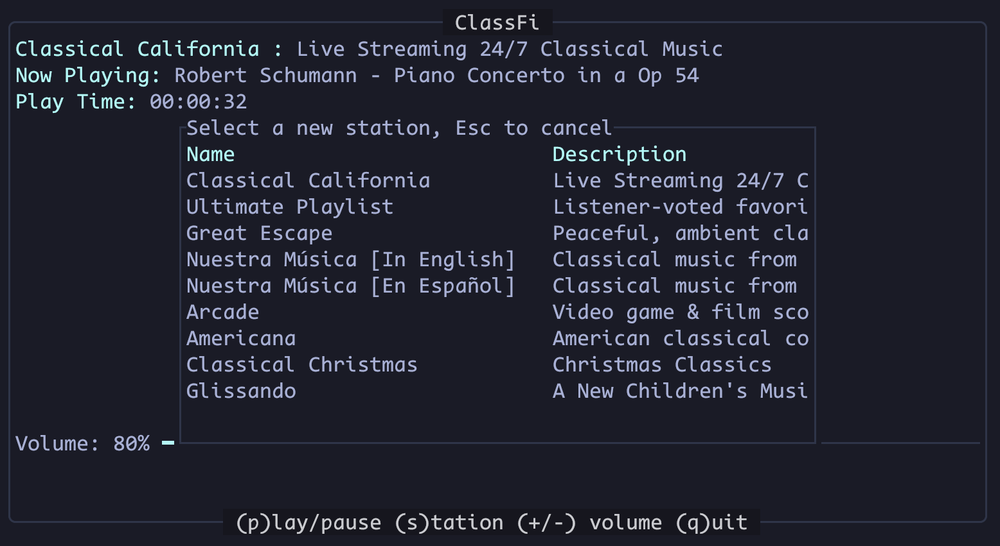

# Classfi - A Simple Classical Music Player

Listen to classical music in your terminal with (almost) no fuss. Heavily inspired by [lowfi](https://github.com/talwat/lowfi), but for classical music from [Classical California](https://www.classicalcalifornia.org/) streams.

## Use

```bash
classfi
```

Yup, thats it.

You want more? Ok then.

CLI Options:

```bash
$ classfi --help
Classical music in your terminal.

Usage: classfi [OPTIONS]

Options:
  -s, --station <STATION>  Initial Station [possible values: classical-california, ultimate, great-escape, nuestra-musica-en, nuestra-musica-es, arcade, americana, christmas, glissando]
  -t, --theme <THEME>      Color Theme Name
  -v, --verbose...         Increase logging verbosity
  -q, --quiet...           Decrease logging verbosity
  -h, --help               Print help
  -V, --version            Print version

```

Player Commands:

```
(p)lay/pause
(+/-) volume adjust
(s)tation selector
(q)uit
```

 

## Install / Prereqs

Ah, the fuss. In order to install, you need to first install libmpv. That probably looks something like:

```bash
sudo apt install libmpv # Debian and friends
sudo dnf install mpv-libs # Fedora and friends
brew install mpv # MacOS
```

Or from [mpv.io](https://mpv.io/installation/)

After that, you can download it from TBD or build it yourself with

```bash
cargo install classfi
```

## TODO

### 0.1.0 Release

- [ ] Mac testing
- [ ] CI release binary for Linux and Mac
  - cargo dist init

### Roadmap

- [ ] cache station URLs to disk
- [ ] Stream info (file type, bitrate, etc)
- [ ] better player state reporting/tracking
  - [ ] test via flakey connection tools
  - [ ] look at ignored messages from mpv
    - Getting URL -> finding stream
    - Got URL -> found stream
    - StartFile -> Connecting
    - FileLoaded -> Connected
    - PlaybackRestart -> Playing
- [ ] add media key handling
- [ ] one line UI
- [ ] Create alternate versions with different sources
  - https://docs.rs/clap/latest/clap/_cookbook/multicall_busybox/index.html

## License

Copyright (c) Adam Milner <carmiac@gmail.com>

This project is licensed under the GPLv3 ([LICENSE] or <https://www.gnu.org/licenses/gpl-3.0.html>)

[LICENSE]: ./LICENSE
